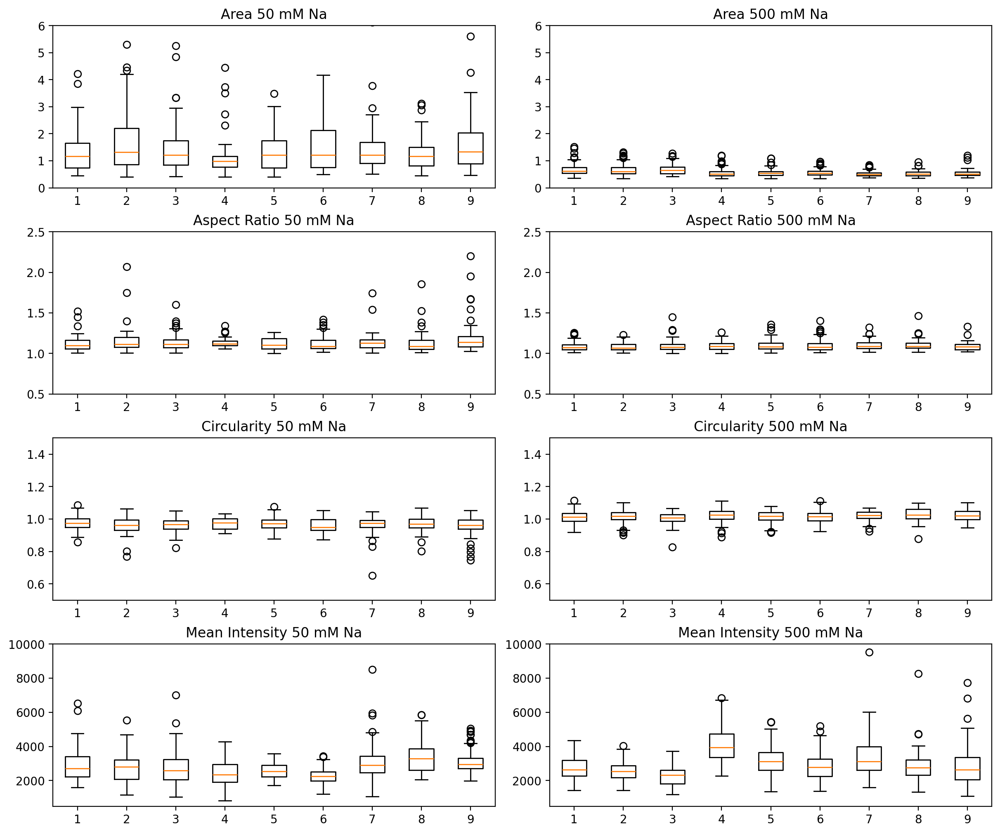
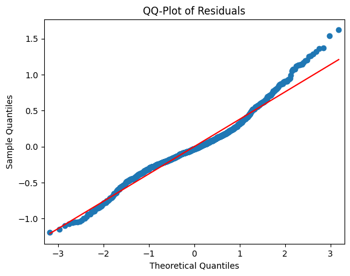
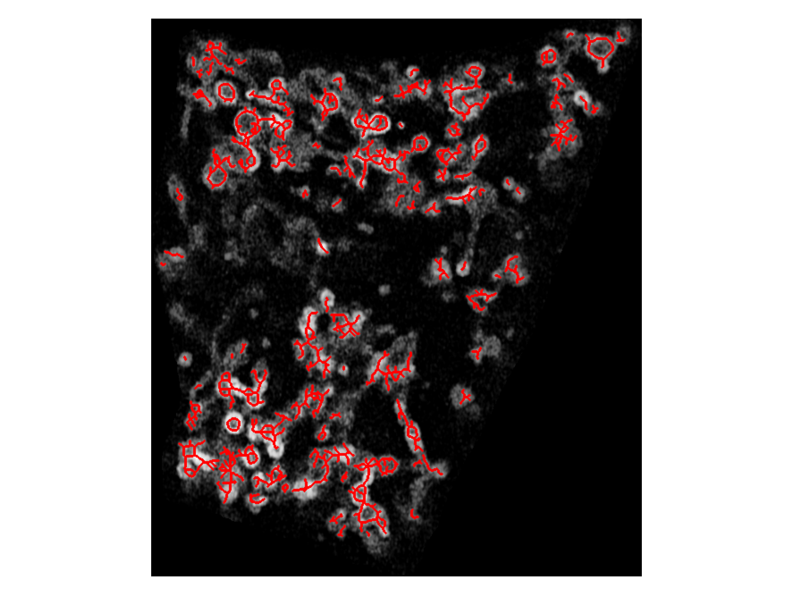
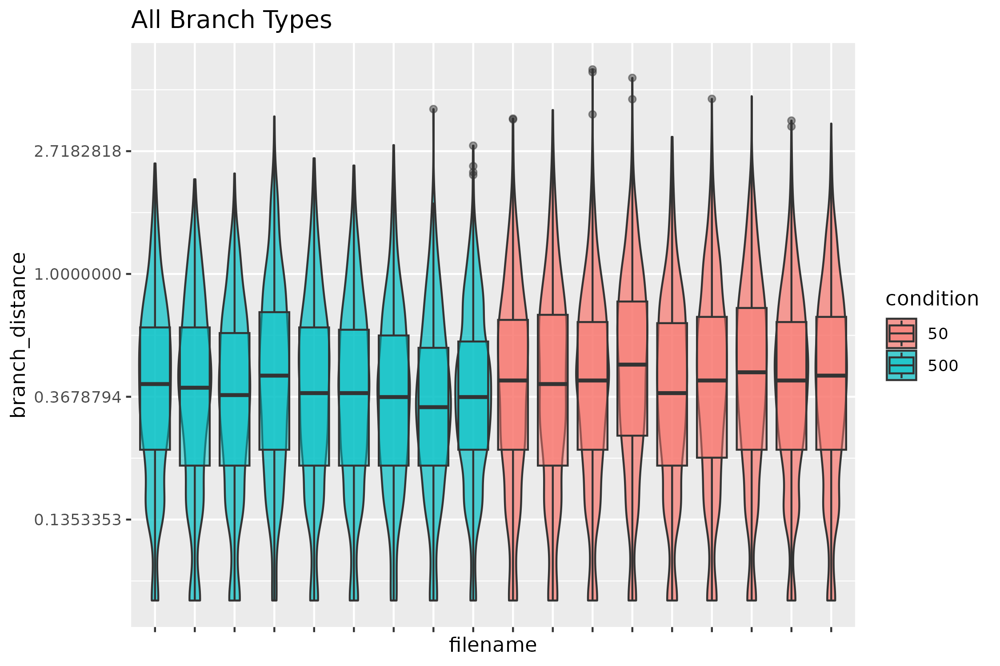
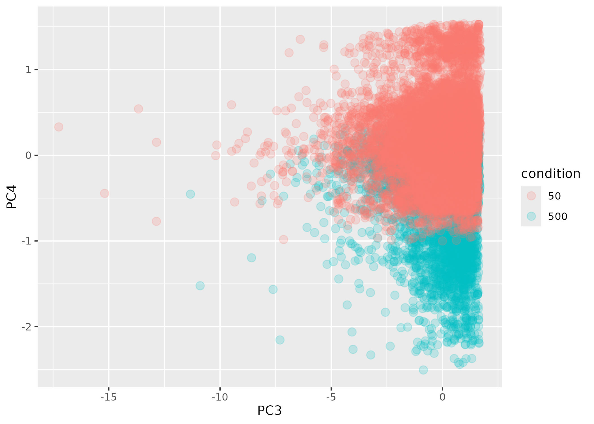

# OIC-181 Report

Total Hours: 40h

Github Repo: https://github.com/vaioic/OIC-181_Mitochondrial_Analysis

## Authorship and Methods

Research supported by the Optical Imaging Core should be acknowledged and considered for authorship. Please refer to our [SharePoint page](https://vanandelinstitute.sharepoint.com/sites/optical/SitePages/Acknowledgements-and-Authorship.aspx) for guidelines.

Please include our RRID in the methods section for any research supported by the OIC. RRID:SCR_021968

### Sample Acknowledgement

We thank the Van Andel Institute Optical Imaging Core (RRID:SCR_021968), especially [staff name], for their assistance with [technique/technology]. This research was supported in part by the Van Andel Institute Optical Imaging Core (RRID:SCR_021968) (Grand Rapids, MI).

## Summary of Request

The client has images of *C. elegans* oocytes with mitochondria tagged with a fluorescent reporter. They are interested in quantifying and comparing the differences observed in the mitochondrial networks in the conditions they are testing (e.g., fragmentation, number of networks).

## Brief summary of analysis pipeline

The analysis pipeline consists of two main parts: a custom trained StarDist model to specifically detect and quantify the ring-like structures made by mitochondria in oocytes; thresholding and skeletonizing the mitochrondrial signal to quantify the number of networks and amount of branching.

## Data

Images were collected on a LSM880 confocal microscope. Z-stacks were acquired and specific optical slices were selected for 2D-based analysis.

## Analysis Pipeline

### StarDist Model Training

[Training Script](/Transfer_learning_StarDist.ipynb)
[Object Detection and Quantification Script](/OIC-181_Mito_Analysis.ipynb)

A custom StarDist model was trained leveraging transfer learning from the dsb_heavy_augment model generated by the [StarDist group](https://github.com/stardist/stardist/tree/main). To train the model, approximately 1/3 of the image slices to analyze were manually annotated using Napari to create training labels (included images from both conditions). The images and masks were then cropped into smaller ROIs to feed into the StarDist network. Script located [here](/Split-Image.ipynb).

Both the images and label ROIs were fed into the StarDist network with random split into 85/15 train and validate groups, and random augmentation (random flips, rotations, and intensity changes). The model was trained with `patch_size=(128,128)`,`batch_size=16`, `learning_rate=1e-5`, and `train_epochs=200` hyperparameters. The `2D_versatile_fluo_Rings` model achieved the best performance with an IoU of ~0.8. Predictions passed visual inspection by the client.

Objects created from the `2D_versatile_fluo_Rings` model were then quantified for number, shape descriptors, and fluorescence intensity measurements using scikit-learn's regionprops module. Additional measurements, such as circularity and aspect ratio were calculated with external python functions and added to the regionprops data frame.

Box plots of measurements split by image and grouped by condition.


A preliminary linear mixed effects model was fitted to natural log transformed area measurements to assess statistical significance between the conditions.



```python
             Mixed Linear Model Regression Results
================================================================
Model:               MixedLM    Dependent Variable:    area_log 
No. Observations:    1374       Method:                REML     
No. Groups:          3          Scale:                 0.1447   
Min. group size:     386        Log-Likelihood:        -630.0766
Max. group size:     500        Converged:             Yes      
Mean group size:     458.0                                      
----------------------------------------------------------------
                     Coef.  Std.Err.    z    P>|z| [0.025 0.975]
----------------------------------------------------------------
Intercept            -0.561    0.042 -13.474 0.000 -0.642 -0.479
C(condition)[T.50mM]  0.780    0.022  35.490 0.000  0.737  0.823
Group Var             0.005    0.013                            
================================================================
```

### Skeleton Analysis with Skan Python Package

To quantify the mitochondrial networks within the oocytes (e.g., branching, length of networks, number of networks) a skeleton-based analysis was selected. Binary masks of the mitochodrial signal were generated by the Yen threshold algorithm. These binary masks were then turned into label images and skeletonized (eroding all masked objects until they are 1-pixel lines).

Example skeleton over layed on image


The skeletons were then passed through the Skan Python package which assigns skeleton IDs, branch labels, and calculates length measurements for all components of each skeleton. The file name and condition were added to the data frame generated by Skan and some preliminary exploration of the data was conducted to assess behavior of the data.



A PCA was fit to the data and found that PCA3 and PCA4 appear to separate out the two conditions to some extent.



## Output

All quantification were exported as csv files: one file for each type of analysis conducted. Data frames and all resulting masks, object detections, and skeletons were uploaded to the client's network drive.

## Notes

The skeleton analysis is dependent on the mask generated from the threshold algorithm. I attempted to use as stringent of a threshold as possible without losing too much signal. If needed, the skeleton analysis could be repeated with different threshold algorithms.